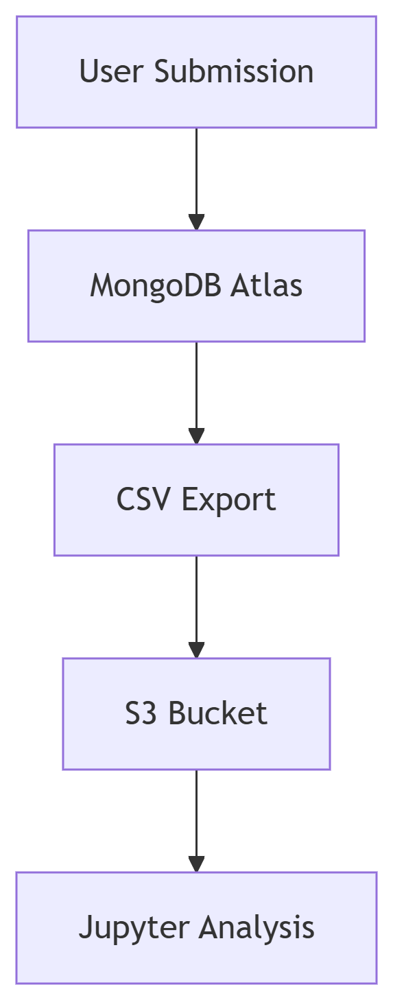

# Healthcare Spending Survey Application  
**Submitted by**: Abdullahi Mohamed Jibril  
 
 
 

##  Live Deployment

##  System Architecture

*Figure 1: End-to-end data collection pipeline*

## Key Features
- **Responsive Survey Form** with client-side validation
- **Real-time MongoDB Storage** with Atlas backups
- **Automated CSV Exports** to AWS S3 (daily)
- **Interactive Visualizations** in Jupyter Notebook

## Quick Start
bash
# Clone repository
git clone https://github.com/Arralle21/healthcare-spending-survey.git
cd healthcare-spending-survey

# Install dependencies
pip install -r requirements.txt

# Configure environment
echo "MONGODB_URI=your_connection_string" > .env
echo "S3_BUCKET_NAME=your-bucket-name" >> .env

# Launch application
python application.py
🔧 API Endpoints
Endpoint	Method	Description
/	GET	Survey form
/submit	POST	Data submission endpoint
/download	GET	CSV export
/health	GET	System status check
🛠 Troubleshooting
MongoDB Connection Issues
✅ Verify IP Access List in Atlas
✅ Check connection string format

S3 Upload Failures
✅ Confirm IAM role has s3:PutObject permission
✅ Validate bucket name and region
